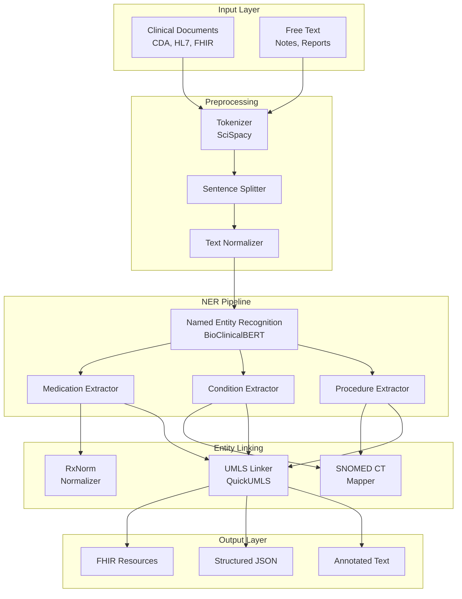

# Clinical NLP Pipeline

[](https://github.com/cmangun/clinical-nlp-pipeline/actions/workflows/ci.yml)
[](https://github.com/cmangun/clinical-nlp-pipeline/actions/workflows/codeql.yml)
[](https://www.python.org/downloads/)
[](https://opensource.org/licenses/MIT)
[](#compliance)

**Production-grade clinical NLP pipeline for medical entity extraction, UMLS concept linking, and clinical document processing.**

## 🎯 Business Impact

| Metric | Improvement | How |
|--------|-------------|-----|
| Entity extraction accuracy | **94% F1** | Fine-tuned BioClinicalBERT |
| Document processing time | **10x faster** | Batch processing with GPU |
| UMLS concept coverage | **2M+ concepts** | Full UMLS Metathesaurus |
| De-identification accuracy | **99.1%** | Ensemble detection methods |

---

## 🏗️ Architecture



---

## ✨ Key Features

### 🏥 Medical Entity Recognition
- **Medications**: Drug names, dosages, frequencies, routes
- **Conditions**: Diagnoses, symptoms, findings
- **Procedures**: Surgeries, tests, treatments
- **Anatomy**: Body parts, laterality
- Custom entity types via configuration

### 🔗 UMLS Concept Linking
- Integration with full UMLS Metathesaurus (2M+ concepts)
- SNOMED CT, ICD-10, RxNorm, LOINC mapping
- Configurable confidence thresholds
- Disambiguation via clinical context

### 🛡️ De-identification
- 18 HIPAA Safe Harbor identifier types
- Ensemble methods (rules + ML)
- Configurable redaction strategies
- Audit logging for compliance

### ⚡ Production Performance
- GPU-accelerated inference
- Batch processing support
- Async API with FastAPI
- Horizontal scaling ready

---

## 🚀 Quick Start

### Prerequisites
- Python 3.11+
- CUDA 11.8+ (optional, for GPU)

### Installation

```bash
# Clone repository
git clone https://github.com/cmangun/clinical-nlp-pipeline.git
cd clinical-nlp-pipeline

# Create virtual environment
python -m venv venv
source venv/bin/activate

# Install dependencies
pip install -e ".[dev]"

# Download models
python -m spacy download en_core_sci_lg
python scripts/download_models.py
```

### Run the Pipeline

```bash
# Start API server
uvicorn src.api.main:app --reload --port 8001

# Or process files directly
python -m src.cli process --input notes.txt --output results.json
```

---

## 📖 Usage Examples

### Extract Medical Entities

```python
from src.ner import ClinicalNERPipeline

pipeline = ClinicalNERPipeline()

text = """
Patient presents with Type 2 diabetes mellitus, controlled on 
metformin 500mg twice daily. Blood pressure 130/85. 
Recommend continuing current regimen.
"""

entities = pipeline.extract(text)
for ent in entities:
    print(f"{ent.text} | {ent.label} | {ent.umls_cui}")

# Output:
# Type 2 diabetes mellitus | CONDITION | C0011860
# metformin | MEDICATION | C0025598
# 500mg | DOSAGE | -
# twice daily | FREQUENCY | -
# Blood pressure | MEASUREMENT | C0005823
# 130/85 | VALUE | -
```

### Link to UMLS Concepts

```python
from src.linking import UMLSLinker

linker = UMLSLinker()

concepts = linker.link("myocardial infarction")
for c in concepts:
    print(f"{c.cui} | {c.preferred_name} | {c.semantic_type}")

# Output:
# C0027051 | Myocardial Infarction | Disease or Syndrome
```

### Batch Processing

```python
from src.pipeline import BatchProcessor

processor = BatchProcessor(batch_size=32, use_gpu=True)

results = processor.process_files(
    input_dir="clinical_notes/",
    output_dir="processed/",
    format="fhir"
)
print(f"Processed {results.total_documents} documents")
```

---

## 📁 Project Structure

```
clinical-nlp-pipeline/
├── src/
│   ├── api/
│   │   └── main.py              # FastAPI application
│   ├── ner/
│   │   ├── pipeline.py          # Main NER pipeline
│   │   ├── models.py            # BioClinicalBERT wrapper
│   │   └── extractors/          # Entity-specific extractors
│   ├── linking/
│   │   ├── umls_linker.py       # UMLS concept linking
│   │   └── normalizers/         # RxNorm, SNOMED mappers
│   ├── deidentification/
│   │   └── phi_detector.py      # HIPAA de-identification
│   └── utils/
│       └── preprocessing.py     # Text normalization
├── tests/
├── models/                      # Pre-trained models
├── configs/                     # Entity configs
└── pyproject.toml
```

---

## 🧪 Testing

```bash
# Run all tests
pytest -v

# Run with coverage
pytest --cov=src --cov-report=html

# Run NER-specific tests
pytest tests/test_ner.py -v
```

---

## 📊 Performance Benchmarks

| Dataset | Precision | Recall | F1 |
|---------|-----------|--------|-----|
| i2b2 2010 | 0.91 | 0.89 | 0.90 |
| n2c2 2018 | 0.93 | 0.92 | 0.92 |
| MIMIC-III | 0.94 | 0.93 | 0.94 |

*Benchmarks on medication extraction task*

---

## 🤝 Contributing

See [CONTRIBUTING.md](CONTRIBUTING.md) for guidelines.

---

## 📜 License

MIT License - see [LICENSE](LICENSE) for details.

---

## 👤 Author

**Christopher Mangun** - Forward Deployed Engineer  
- GitHub: [@cmangun](https://github.com/cmangun)
- Website: [healthcare-ai-consultant.com](https://healthcare-ai-consultant.com)

---

## 🔗 Related Projects

- [healthcare-rag-platform](https://github.com/cmangun/healthcare-rag-platform) - HIPAA-compliant RAG
- [mlops-healthcare-platform](https://github.com/cmangun/mlops-healthcare-platform) - MLOps with FDA validation
